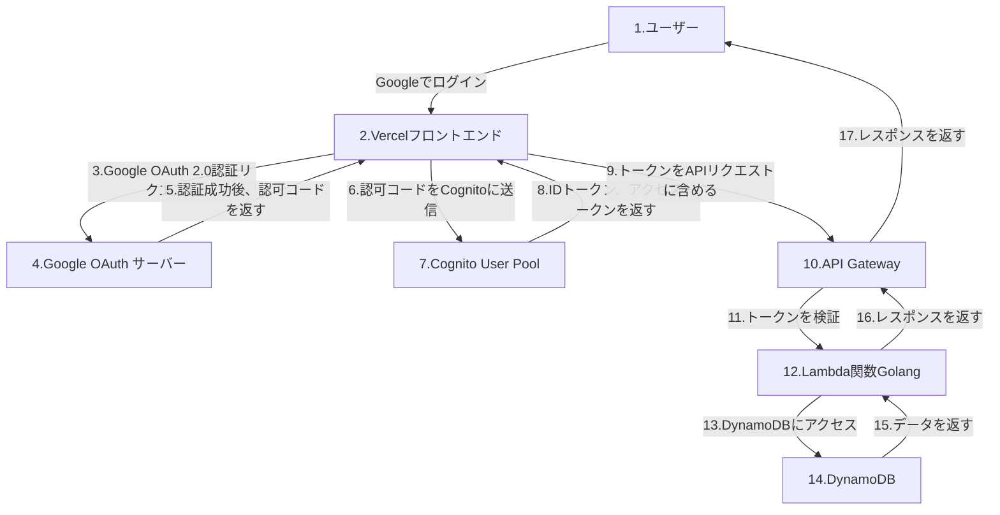
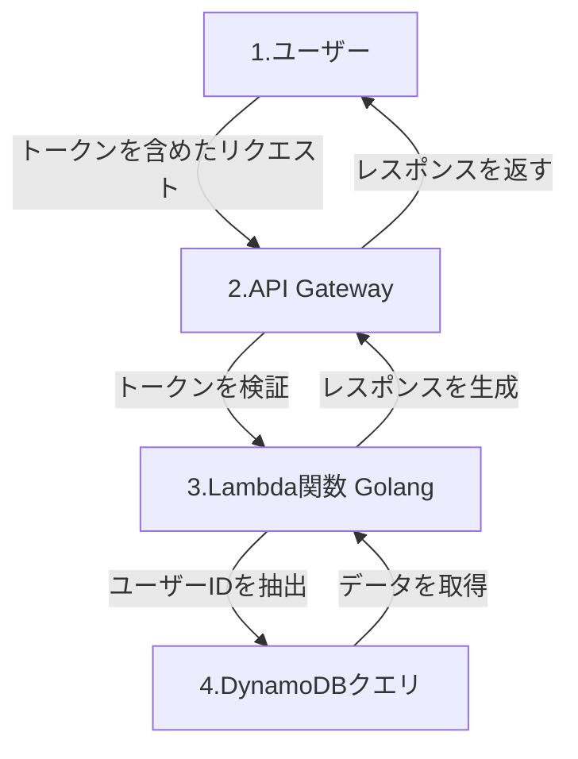

# シンプル TODO API

このプロジェクトは、Go で構築されたシンプルな TODO リスト管理 API です。API は OpenAPI 仕様を使用して定義され、`oapi-codegen`を使用してコードが生成されます。

## コード生成手順

1. **OpenAPI スキーマの定義**

   - OpenAPI スキーマは`openapi/`フォルダーに定義されています。
   - モジュール化されたスキーマは、整理のために`openapi/schemas/`フォルダーに保存されています。

2. **コードの生成**

   - 以下のコマンドを使用して API コードを生成します:
     ```bash
     oapi-codegen -package api -generate types,gin,spec,models,strict-server -o backend/api/api.gen.go openapi/openapi.yaml
     ```
   - このコマンドは、`api/`フォルダー内に型、Gin ハンドラー、OpenAPI 仕様、モデル、および厳密なサーバーインターフェースを生成します。

3. **アプリケーションの実行**
   - コードを生成した後、サーバーロジックを実装し、アプリケーションを実行します。

## フォルダ構成

- `openapi/`: OpenAPI スキーマ定義を含みます。
- `api/`: 生成された API コードを含みます。
- `db/`: （オプション）データベーススキーマや関連ファイルを含みます。

## 前提条件

- Go 1.21.5 以上
- `oapi-codegen`のインストール:
  ```bash
  go install github.com/deepmap/oapi-codegen/cmd/oapi-codegen@latest
  ```

## インフラストラクチャのセットアップ

TODO アプリケーションのインフラストラクチャを Terraform を使用してセットアップする手順は以下の通りです:

1. **Terraform のインストール**

- システムに Terraform がインストールされていることを確認してください。[Terraform 公式サイト](https://www.terraform.io/downloads)からダウンロードできます。

2. **環境変数の設定**

- 機密情報を保護するため、Google Client ID と Secret を環境変数としてエクスポートします:
  ```bash
  export TF_VAR_google_client_id="<YOUR_GOOGLE_CLIENT_ID>"
  export TF_VAR_google_client_secret="<YOUR_GOOGLE_CLIENT_SECRET>"
  ```
  `<YOUR_GOOGLE_CLIENT_ID>`と`<YOUR_GOOGLE_CLIENT_SECRET>`を Google Cloud Console から取得した値に置き換えてください。

### Google Cloud Console からのクライアント ID とクライアントシークレットの取得方法

1. **Google Cloud Console にログイン**

   - [Google Cloud Console](https://console.cloud.google.com/)にアクセスし、Google アカウントでログインします。

2. **プロジェクトを作成または選択**

   - 左上の「プロジェクトを選択」をクリックし、新しいプロジェクトを作成するか、既存のプロジェクトを選択します。

3. **OAuth 同意画面の設定**

   - 左側のメニューから「API とサービス」 > 「OAuth 同意画面」を選択します。
   - 必要な情報（アプリケーション名、サポートメールなど）を入力し、保存します。

4. **OAuth 2.0 クライアント ID を作成**

   - 「API とサービス」 > 「認証情報」を選択します。
   - 「認証情報を作成」ボタンをクリックし、「OAuth 2.0 クライアント ID」を選択します。
   - アプリケーションの種類を「ウェブアプリケーション」に設定します。
   - リダイレクト URI を設定します（例: `https://example.com/callback`）。
   - 作成をクリックすると、クライアント ID とクライアントシークレットが表示されます。

5. **クライアント ID とクライアントシークレットをコピー**

   - 表示されたクライアント ID とクライアントシークレットをコピーし、以下のコマンドで環境変数として設定します。
     ```bash
     export TF_VAR_google_client_id="<YOUR_GOOGLE_CLIENT_ID>"
     export TF_VAR_google_client_secret="<YOUR_GOOGLE_CLIENT_SECRET>"
     ```

6. **Terraform で適用**

   - 環境変数を設定した状態で、Terraform の手順に従ってインフラをデプロイします。

7. **Terraform の初期化**

- `infrastructure`フォルダーに移動し、Terraform を初期化します:
  ```bash
  cd infrastructure
  terraform init
  ```

4. **Terraform 構成の適用**

- 必要な AWS リソースを作成するために構成を適用します:
  ```bash
  terraform apply
  ```
- プランを確認し、`yes`と入力して確定します。

5. **セットアップの確認**

- リソースが作成された後、AWS マネジメントコンソールで Cognito ユーザープール、アイデンティティプール、DynamoDB テーブル、および IAM ロールが正しく設定されていることを確認します。

6. **アプリケーション構成の更新**

- 認証に Cognito ユーザープールとアイデンティティプール ID を使用するようにアプリケーションを更新します。
- データストレージには DynamoDB テーブル名（`AppData`）を使用してください。

### Google 認証フロー（順序付き）

以下は、Google 認証を使用した Cognito の認証フローを順序付きで示したものです。フロントエンドは Vercel 上で動作し、バックエンドは API Gateway と Lambda を使用して構築されています。



### フローの詳細

1. **Google でログイン**:

   - ユーザーがフロントエンドで「Google でログイン」ボタンをクリックします。

2. **Google OAuth 2.0 認証**:

   - フロントエンドが Google OAuth サーバーに認証リクエストを送信します。
   - ユーザーが Google アカウントで認証を行い、認可コードがフロントエンドに返されます。

3. **Cognito への認可コード送信**:

   - フロントエンドが認可コードを Cognito User Pool に送信します。
   - Cognito は Google からトークンを取得し、ユーザーに対応する ID トークンとアクセストークンを発行します。

4. **API リクエスト**:

   - フロントエンドが取得したトークンを API リクエストに含めて API Gateway に送信します。

5. **トークンの検証**:

   - API Gateway または Lambda 関数で Cognito の公開鍵を使用してトークンを検証します。

6. **DynamoDB へのアクセス**:

   - Lambda 関数が認証済みユーザーとして DynamoDB にアクセスし、必要なデータを取得または操作します。

7. **レスポンスの返却**:
   - DynamoDB から取得したデータを Lambda 関数が処理し、API Gateway を通じてフロントエンドに返します。

このフローにより、Google 認証を使用した安全な認証とデータアクセスが実現されます。

### 認可フロー

以下は、Google 認証を使用した Cognito の認可フローを示したものです。認証済みのユーザーが自分のデータにのみアクセスできるように設計されています。



### フローの詳細

1. **ユーザーがリクエストを送信**:

   - フロントエンドから API Gateway にトークンを含めたリクエストを送信します。

2. **トークンの検証**:

   - API Gateway または Lambda 関数で Cognito の公開鍵を使用してトークンを検証します。

3. **ユーザー ID の抽出**:

   - トークンのペイロードから`sub`（Cognito のユーザー ID）を抽出します。

4. **DynamoDB へのアクセス**:

   - Lambda 関数がユーザー ID を使用して DynamoDB にアクセスし、リクエストされたデータを取得または操作します。

5. **レスポンスの返却**:
   - DynamoDB から取得したデータを Lambda 関数が処理し、API Gateway を通じてフロントエンドに返します。

このフローにより、認証済みユーザーが自分のデータにのみアクセスできるように制御されます。
