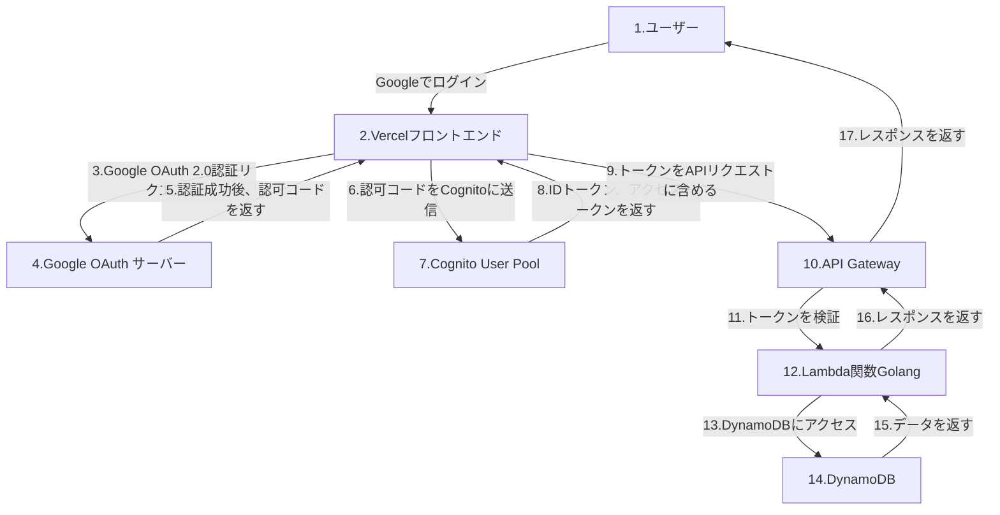
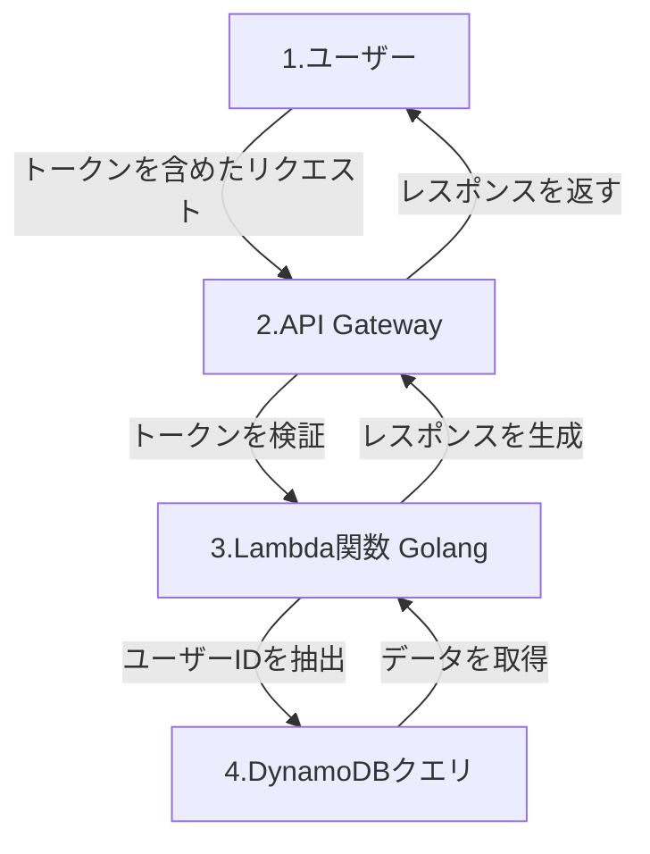

# シンプルTODO API

このプロジェクトは、Goで構築されたシンプルなTODOリスト管理APIです。APIはOpenAPI仕様を使用して定義され、`oapi-codegen`を使用してコードが生成されます。

## コード生成手順

1. **OpenAPIスキーマの定義**
    - OpenAPIスキーマは`openapi/`フォルダーに定義されています。
    - モジュール化されたスキーマは、整理のために`openapi/schemas/`フォルダーに保存されています。

2. **コードの生成**
    - 以下のコマンドを使用してAPIコードを生成します:
      ```bash
      oapi-codegen -package api -generate types,gin,spec,models,strict-server -o api/api.gen.go openapi/openapi.yaml
      ```
    - このコマンドは、`api/`フォルダー内に型、Ginハンドラー、OpenAPI仕様、モデル、および厳密なサーバーインターフェースを生成します。

3. **アプリケーションの実行**
    - コードを生成した後、サーバーロジックを実装し、アプリケーションを実行します。

## フォルダ構成
- `openapi/`: OpenAPIスキーマ定義を含みます。
- `api/`: 生成されたAPIコードを含みます。
- `db/`: （オプション）データベーススキーマや関連ファイルを含みます。

## 前提条件
- Go 1.21.5以上
- `oapi-codegen`のインストール:
  ```bash
  go install github.com/deepmap/oapi-codegen/cmd/oapi-codegen@latest
  ```

## インフラストラクチャのセットアップ

TODOアプリケーションのインフラストラクチャをTerraformを使用してセットアップする手順は以下の通りです:

1. **Terraformのインストール**
  - システムにTerraformがインストールされていることを確認してください。[Terraform公式サイト](https://www.terraform.io/downloads)からダウンロードできます。

2. **環境変数の設定**
  - 機密情報を保護するため、Google Client IDとSecretを環境変数としてエクスポートします:
    ```bash
    export TF_VAR_google_client_id="<YOUR_GOOGLE_CLIENT_ID>"
    export TF_VAR_google_client_secret="<YOUR_GOOGLE_CLIENT_SECRET>"
    ```
    `<YOUR_GOOGLE_CLIENT_ID>`と`<YOUR_GOOGLE_CLIENT_SECRET>`をGoogle Cloud Consoleから取得した値に置き換えてください。

### Google Cloud ConsoleからのクライアントIDとクライアントシークレットの取得方法

1. **Google Cloud Consoleにログイン**
   - [Google Cloud Console](https://console.cloud.google.com/)にアクセスし、Googleアカウントでログインします。

2. **プロジェクトを作成または選択**
   - 左上の「プロジェクトを選択」をクリックし、新しいプロジェクトを作成するか、既存のプロジェクトを選択します。

3. **OAuth同意画面の設定**
   - 左側のメニューから「APIとサービス」 > 「OAuth同意画面」を選択します。
   - 必要な情報（アプリケーション名、サポートメールなど）を入力し、保存します。

4. **OAuth 2.0 クライアントIDを作成**
   - 「APIとサービス」 > 「認証情報」を選択します。
   - 「認証情報を作成」ボタンをクリックし、「OAuth 2.0 クライアントID」を選択します。
   - アプリケーションの種類を「ウェブアプリケーション」に設定します。
   - リダイレクトURIを設定します（例: `https://example.com/callback`）。
   - 作成をクリックすると、クライアントIDとクライアントシークレットが表示されます。

5. **クライアントIDとクライアントシークレットをコピー**
   - 表示されたクライアントIDとクライアントシークレットをコピーし、以下のコマンドで環境変数として設定します。
     ```bash
     export TF_VAR_google_client_id="<YOUR_GOOGLE_CLIENT_ID>"
     export TF_VAR_google_client_secret="<YOUR_GOOGLE_CLIENT_SECRET>"
     ```

6. **Terraformで適用**
   - 環境変数を設定した状態で、Terraformの手順に従ってインフラをデプロイします。

3. **Terraformの初期化**
  - `infrastructure`フォルダーに移動し、Terraformを初期化します:
    ```bash
    cd infrastructure
    terraform init
    ```

4. **Terraform構成の適用**
  - 必要なAWSリソースを作成するために構成を適用します:
    ```bash
    terraform apply
    ```
  - プランを確認し、`yes`と入力して確定します。

5. **セットアップの確認**
  - リソースが作成された後、AWSマネジメントコンソールでCognitoユーザープール、アイデンティティプール、DynamoDBテーブル、およびIAMロールが正しく設定されていることを確認します。

6. **アプリケーション構成の更新**
  - 認証にCognitoユーザープールとアイデンティティプールIDを使用するようにアプリケーションを更新します。
  - データストレージにはDynamoDBテーブル名（`AppData`）を使用してください。

### Google認証フロー（順序付き）

以下は、Google認証を使用したCognitoの認証フローを順序付きで示したものです。フロントエンドはVercel上で動作し、バックエンドはAPI GatewayとLambdaを使用して構築されています。



### フローの詳細
1. **Googleでログイン**:
   - ユーザーがフロントエンドで「Googleでログイン」ボタンをクリックします。

2. **Google OAuth 2.0認証**:
   - フロントエンドがGoogle OAuthサーバーに認証リクエストを送信します。
   - ユーザーがGoogleアカウントで認証を行い、認可コードがフロントエンドに返されます。

3. **Cognitoへの認可コード送信**:
   - フロントエンドが認可コードをCognito User Poolに送信します。
   - CognitoはGoogleからトークンを取得し、ユーザーに対応するIDトークンとアクセストークンを発行します。

4. **APIリクエスト**:
   - フロントエンドが取得したトークンをAPIリクエストに含めてAPI Gatewayに送信します。

5. **トークンの検証**:
   - API GatewayまたはLambda関数でCognitoの公開鍵を使用してトークンを検証します。

6. **DynamoDBへのアクセス**:
   - Lambda関数が認証済みユーザーとしてDynamoDBにアクセスし、必要なデータを取得または操作します。

7. **レスポンスの返却**:
   - DynamoDBから取得したデータをLambda関数が処理し、API Gatewayを通じてフロントエンドに返します。

このフローにより、Google認証を使用した安全な認証とデータアクセスが実現されます。

### 認可フロー

以下は、Google認証を使用したCognitoの認可フローを示したものです。認証済みのユーザーが自分のデータにのみアクセスできるように設計されています。



### フローの詳細
1. **ユーザーがリクエストを送信**:
   - フロントエンドからAPI Gatewayにトークンを含めたリクエストを送信します。

2. **トークンの検証**:
   - API GatewayまたはLambda関数でCognitoの公開鍵を使用してトークンを検証します。

3. **ユーザーIDの抽出**:
   - トークンのペイロードから`sub`（CognitoのユーザーID）を抽出します。

4. **DynamoDBへのアクセス**:
   - Lambda関数がユーザーIDを使用してDynamoDBにアクセスし、リクエストされたデータを取得または操作します。

5. **レスポンスの返却**:
   - DynamoDBから取得したデータをLambda関数が処理し、API Gatewayを通じてフロントエンドに返します。

このフローにより、認証済みユーザーが自分のデータにのみアクセスできるように制御されます。
